> [!summary] Bottom line
> The distal nodular elements of the catshark (*Scyliorhinus canicula*) pectoral fin, unlike the stripes of mouse digits, appear as a single row of Sox9 "spots." The authors extend the Bmp–Sox9–Wnt (BSW) Turing network proposed for mouse digit formation with spatial modulation by an Fgf gradient, and show the model qualitatively reproduces this spot pattern and the phenotypes of Bmp/Wnt inhibition — **suggesting** that the diversity of distal fin and limb skeletons could arise from "the spatial re-organization of a deeply conserved Turing mechanism." This is not direct proof of causation but an inference from the match between model predictions and inhibition-experiment phenotypes; the mechanism forming the more proximal, stripe-like elements remains unresolved.

## Bibliography

- Authors: Koh Onimaru, Luciano Marcon, Marco Musy, Mikiko Tanaka, James Sharpe
- Venue, year: *Nature Communications* 7:11582 (2016). Received 2016-04-11, published 2016-05-23
- DOI: 10.1038/ncomms11582
- PDF: [[10_Reference/Papers/Onimaru et al. 2016 - The fin-to-limb transition as the re-organization of a Turing pattern.pdf]]
- mdpaper: [[20_MDPapers/Onimaru et al. 2016 - The fin-to-limb transition as the re-organization of a Turing pattern]]

## Question

- Mouse digit placement has been proposed to arise from a Turing mechanism involving BMP, SOX9, and WNT (the BSW model, ref. 12). Is this mechanism general beyond mouse?
- Given that the gene repertoire is largely conserved, why do the distal fin and limb skeletons differ so much in arrangement? Since Turing systems can switch between spots and stripes with small parameter changes, can changes to the BSW model explain this difference?
- Why catshark (Introduction): its fin skeletal elements form as discrete condensations resembling limb condensations, and its genome is less derived than teleost genomes.

## Approach

- **Expression analysis**: whole-mount in situ hybridization plus optical projection tomography (OPT) to follow the Sox9 time course (stages 29–30; Fig. 1b) and to observe Bmp4, Wnt5b, Hoxa13, Dusp6, and other genes in 3D.
- **Growth model**: fin bud outlines from stages 25/26–32 were interpolated day by day, and a triangular mesh was built for each shape in a 2D growth model (Fig. 3; Methods). The growth map was constrained by comparing actual fate maps (labeled with Indian ink at stage 26–28 and cultured ~30 days) against candidate virtual fate maps.
- **Mathematical model**: the BSW model (eqs 1–3; S does not diffuse, B and W do). An Fgf gradient F diffusing from the distal tip modulates the network by suppressing k4 and enhancing k7 (eqs 16–19). Linear stability analysis defines the Turing space (eq. 15; Fig. 4c); stages 29→31 were simulated numerically on the growth mesh (the solver is given in the text as "Huen method" — the correct name is unconfirmed; see Open points. Time step 0.002, 1% Gaussian multiplicative noise per step, zero-flux boundary).
- **Perturbation experiments**: embryos were removed from their egg cases and drug-treated in artificial seawater (1% DMSO). Fgf receptor inhibitor SU5402 (100 µM), Bmp inhibitor LDN-193189 (50 µM), Wnt secretion (porcupine) inhibitor C59 (20 µM). For expression analysis, treatment ran 4 days from early stage 30. For Alcian Blue cartilage staining, 20 days of drug treatment followed by 10–20 days in normal seawater. Inhibition efficiency was confirmed by qPCR and in situ for target genes (Supplementary Fig. 5c, 6a–c; not checked in this note).

## Main results

- **Sox9 appears distally as a single row of spots** (Fig. 1b). It starts at the basal element and posterior-distal region as an arc-shaped row that is initially continuous posteriorly, then later resolves into spots. These spots correspond to the second row of distal nodular elements in the final skeleton (main text; see Supplementary Fig. 1 for detail). This contrasts with the striped Sox9 pattern in mouse.
- **Bmp and Wnt are out of phase with Sox9** (Fig. 2b,c). Bmp4 and Wnt5b expression show a row of "gaps" corresponding to the Sox9 spots (stage 30, left and right fins of the same embryo). Lef1 also shows a shallow complementary pattern (Supplementary Fig. 2c). By contrast, Bmp2 — the most strongly out-of-phase gene in mouse — is expressed only at the fin margin in catshark (Supplementary Fig. 2a).
- **The BSW model without Fgf modulation does not reproduce the actual pattern**: if Wnt production is set much higher than Bmp production, spots form, but on the growth model they appear as a uniformly scattered pattern unlike the real one (Supplementary Fig. 5a; not checked in this note).
- **Hoxa13 was not adopted as a spatial-control factor analogous to mouse Hoxd13**: Hoxa13's expression domain does not significantly overlap the distal Sox9 domain (Fig. 4b, stage 30). This is an inference from expression imaging, not a Hox loss-of-function experiment.
- **An Fgf-modulated BSW model reproduces the arc-shaped spot row** (Fig. 4d). Two features match the real data: (a) it starts at the anterior/posterior (more proximal) ends and extends distally, and (b) the initially continuous region resolves into spots. The simulated Fgf gradient "roughly" resembles the expression domain of the Fgf target gene Dusp6 (Fig. 4c).
- **Growth's contribution (suggestive)**: in a static fin shape, spot separation lags behind the growing case (Supplementary Fig. 5b). The authors only go so far as to say "growth may contribute to robust spot separation."
- **Fgf inhibition shifts the Sox9 row distally** (model prediction, Fig. 4f; experiment, Fig. 4g). With SU5402, the distance between the distal Sox9 row and the fin margin shrinks (SU5402 n = 7/12, DMSO control n = 8/8; stage 30), though there is variability — loss of periodicity and loss of anterior expression in some cases (main text; Supplementary Fig. 5d).
- **Bmp inhibition**: reducing k2 by 20% in the model abolishes the most distal spot and shrinks the remaining ones (Fig. 5b). LDN-193189 causes partial or complete loss of Sox9 spots (Fig. 5e; n = 6/8), and Alcian Blue staining shows loss of posterior nodular elements with smaller remaining ones (Fig. 5h; n = 2/2). DMSO controls: Sox9 n = 18/18, cartilage n = 3/3. Longer treatment "sometimes" produced AER-like structures and a widened fin bud (Supplementary Fig. 6d).
- **Wnt inhibition**: reducing αW by 50% in the model partially fuses the spots into larger ones (Fig. 5c). C59 causes Sox9 to partially or fully fuse into a continuous domain parallel to the distal margin (Fig. 5f; n = 10/10), and cartilage also becomes continuous or forms large condensations (Fig. 5i; n = 3/3).

## Main figures

### Fig. 1 — Time course of Sox9 expression in the catshark pectoral fin

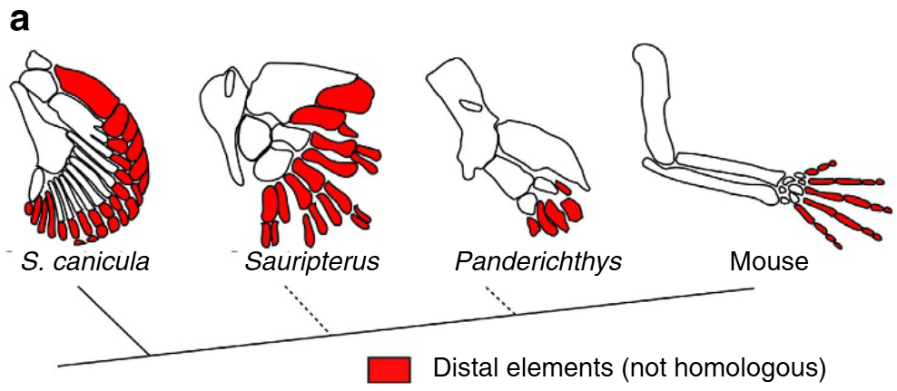

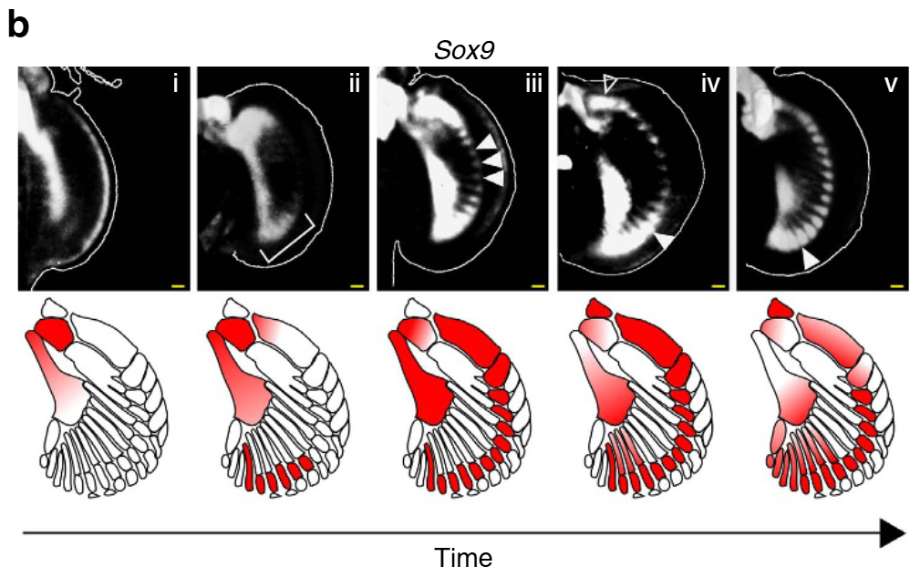

- What it shows: (a) Schematic skeletons of catshark, fossil fins (*Sauripterus*, *Panderichthys*), and mouse forelimb. Red marks the distal elements, with the legend "Distal elements (not homologous)," plus a phylogeny. (b) Top row: five OPT images of Sox9 (i–v, in time order); bottom row: schematics in red showing where each time point's Sox9 maps onto the final skeleton.
- Panel-to-claim mapping: the bracket in b-ii marks early posterior-distal expression; the white arrowheads in b-iii mark the arc-shaped spot row; the arrowheads in b-iv/v mark the posterior region resolving into spots.
- Text/caption source: Results, "The first periodic expression of Sox9 is a distal row of spots"; Fig. 1 caption (stages 29–30, dorsal view, anterior up, distal right, scale bar 100 µm). The individual stage for each panel is not given in either the figure or the caption.

### Fig. 2 — Bmp and Wnt are out of phase with Sox9

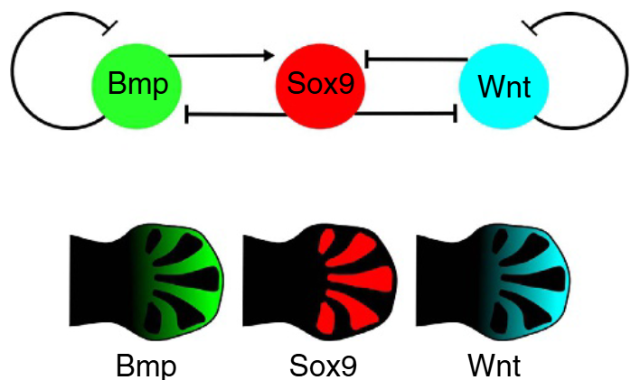

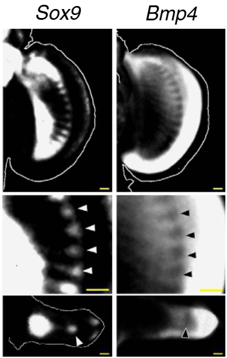

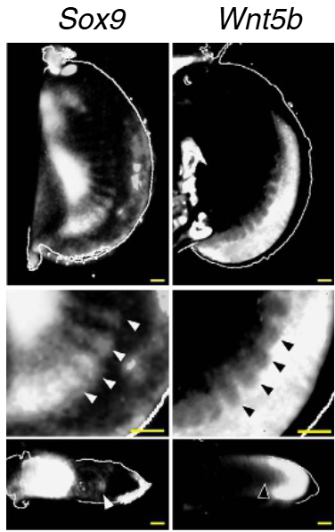

- What it shows: (a) Schematic of the BSW network for mouse digit formation (Bmp→Sox9 activation, Sox9⊣Bmp, Wnt⊣Sox9, Sox9⊣Wnt, Bmp and Wnt self-repression) and a schematic distribution of Bmp (green), Sox9 (red), Wnt (cyan). (b) OPT images of Sox9 and Bmp4, (c) Sox9 and Wnt5b. Top row: whole view; middle row: close-up (arrowheads mark Bmp4/Wnt5b gaps corresponding to Sox9 spots); bottom row: virtual transverse sections.
- Panel-to-claim mapping: the arrowhead rows in the middle rows of b and c are the evidence for being "out of phase (complementary)." The bottom rows of b show that both the Sox9 spots and the Bmp4 gap sit at the center of the bud (as in mouse).
- Text/caption source: Results, "Out-of-phase patterns of Bmp and Wnt expression with Sox9"; Fig. 2 caption (stage 30, left and right fins of the same embryo, Sox9 image mirrored).

### Fig. 3 — Building the fin growth model (selected panels)

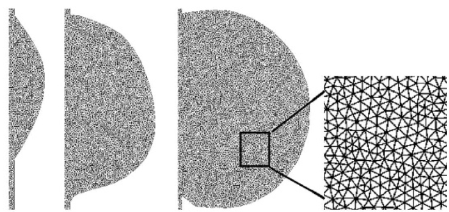

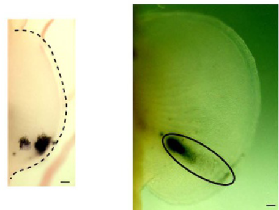

- What it shows: (b) A fine triangular mesh discretizing the fin shape at each growth-model time point (with a close-up on the right). (d) Two photographs of the actual fate map made with Indian ink (left: dashed line marks the fin outline; right: an ellipse marks the extent of labeled tissue).
- Panel-to-claim mapping: (d) is the actual measurement compared against the virtual fate map (Fig. 3c, not included in this note) used to determine the growth map. The anterior–posterior asymmetric growth (posterior expanding more) is based on Supplementary Fig. 4b–e, which can't be read from these two panels alone.
- Text/caption source: Results, "A dynamical model of S. canicula fin development"; Fig. 3 caption; Methods, "Fate map analysis," "In silico modelling." Figure and panel numbers were assigned by matching caption content to image content (no panel letters appear in the images).

### Fig. 4 — The Fgf-modulated Turing model reproduces the Sox9 spot pattern

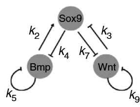

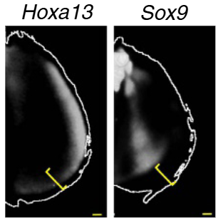

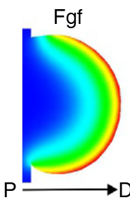

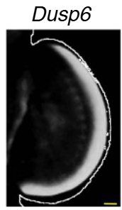

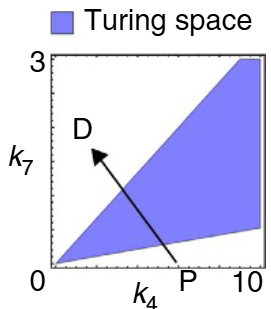

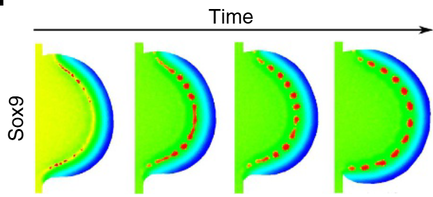

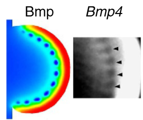

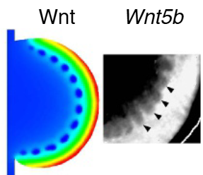

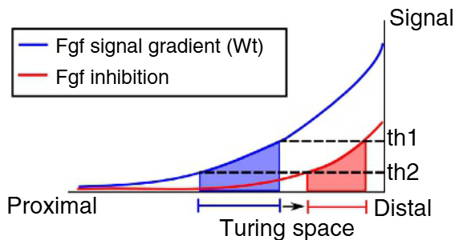

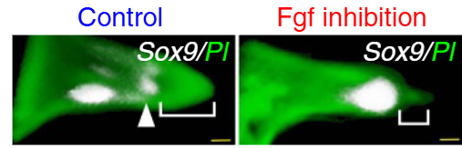

- What it shows:
  - (a) The parameterized network (k2: Bmp→Sox9, k3: Wnt⊣Sox9, k4: Sox9⊣Bmp, k7: Sox9⊣Wnt, k5/k9: self-terms).
  - (b) Hoxa13 and Sox9 (yellow brackets mark Sox9's distance from the fin margin).
  - (c) A simulated Fgf gradient, high proximally (blue) to low distally (red) — note: reproduced here as drawn in the figure — Dusp6 expression, the Turing space (blue) in the k4–k7 plane, with a P→D arrow along the Fgf gradient.
  - (d) Time course of Sox9 on the growth model (red = high concentration). A continuous band resolves into a row of spots.
  - (e) Final-time-point simulated Bmp and Wnt (high distally, with gaps at spot positions) alongside actual Bmp4 and Wnt5b (black arrowheads mark the gaps).
  - (f) Schematic of Fgf signal strength and position. The Turing pattern forms between th1 and th2; suppressing Fgf shifts this region distally.
  - (g) Virtual sections of Sox9 (white)/PI (green). The bracket (distance of distal Sox9 from the fin margin) is longer in controls and shorter under Fgf inhibition.
- Panel-to-claim mapping: (c, right) shows how the model's proximal-to-distal path crosses the Turing space; (d) reproduces the spot row; (e) shows the Bmp/Wnt prediction matching real data; (f) is the Fgf-inhibition prediction; (g) is its experimental test.
- Text/caption source: Results, "In silico modelling of the spot-type Sox9 expressions" and the Fgf-inhibition paragraph; Fig. 4 caption (g: DMSO n = 8/8, SU5402 n = 7/12, stage 30). Panel letters are visible in the PDF only as a fragment at the top-left of a015 (panel d); all other panel assignments here were made by matching caption content to image content.

### Fig. 5 — The model predicts in vivo perturbation phenotypes

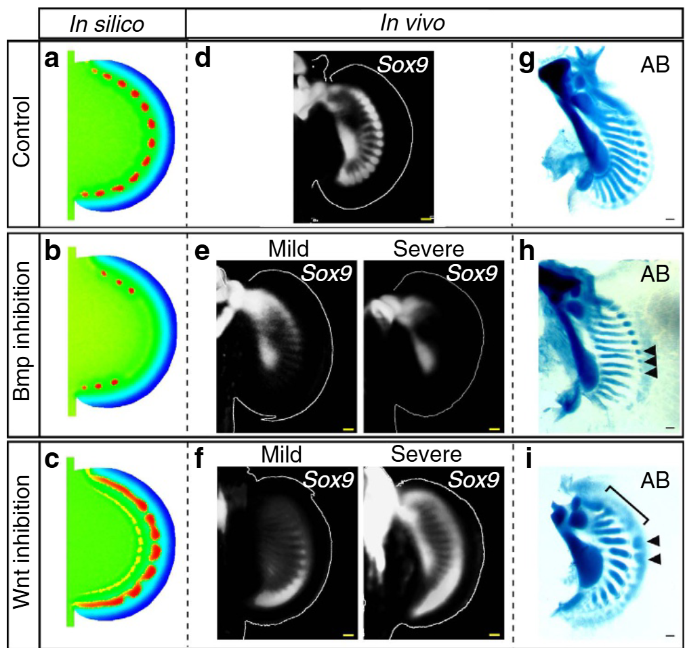

- What it shows: rows are control / Bmp inhibition / Wnt inhibition; columns are in silico (a–c), in vivo Sox9 (d–f), and Alcian Blue cartilage staining (g–i). e and f each show "Mild" and "Severe" examples side by side.
- Panel-to-claim mapping: b (k2 −20%) shows fewer, smaller spots ↔ e shows loss of Sox9 spots ↔ h shows loss of posterior elements and small nodules (arrowheads). c (αW −50%) shows fused spots ↔ f shows a continuous Sox9 domain ↔ i shows continuous or large elements (brackets) and large nodules (arrowheads).
- Text/caption source: Results, "Experimental tests for in silico model predictions"; Fig. 5 caption (n values given above under "Main results").

### Fig. 6 — Comparing fins and limbs (differing roles of Fgf)

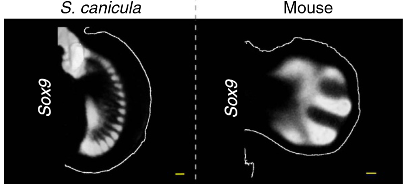

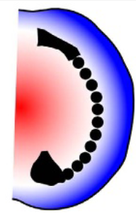

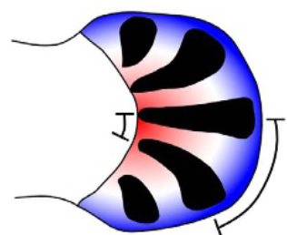

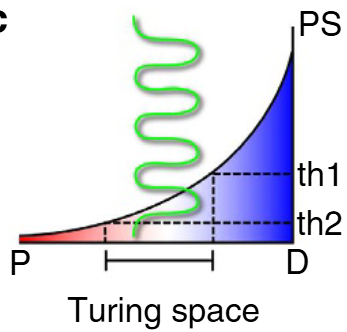

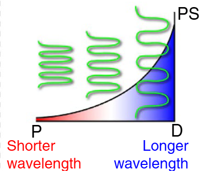

- What it shows: (a) Sox9 in the catshark pectoral fin (stage 30) and mouse digit (E12). (b) Schematic of Sox9 (black) and the proximal-to-distal positional gradient (red→blue); catshark shows a spot row parallel to the margin, mouse shows stripes perpendicular to it, with a larger wavelength distally (bracket). (c) Positional signal (PS) vs. position graphs: in catshark, spots form only between th1 and th2, while in mouse, stripes form across the whole gradient, with the local Fgf level setting the local wavelength (short proximally, long distally).
- Panel-to-claim mapping: illustrates the proposal (Discussion) that "Fgf's role is to position the spot row in catshark, but to control stripe orientation and wavelength in mouse." This is a model-based proposal, not direct experimental evidence.
- Text/caption source: Discussion, paragraph 5; Fig. 6 caption.

## Mechanism and interpretation

- **Core model**: a three-component Turing system with non-diffusing Sox9 and diffusing Bmp and Wnt. In catshark, a proximal-to-distal Fgf gradient pushes the system "into and back out of the Turing space," so that a pattern forms only in a band at a fixed distance from the fin margin, producing the arc-shaped spot row (Fig. 4c,f).
- **The conservation claim**: although molecular details differ (Bmp4 is the main Bmp ligand candidate in catshark vs. BMP2 in mouse), the basic Bmp–Wnt–Sox9–Fgf interactions are the same in both species, and responses to Bmp/Wnt inhibition resemble those in mouse. The authors frame this as a new example of "deep homology" spanning skeletal pattern formation from sharks to mammals.
- **Handling of distal Hox in the catshark model**: whereas the mouse model has Hoxd13 restrict the region of Turing instability, catshark Hoxa13's expression domain does not significantly overlap Sox9, so distal Hox is not included in the catshark model (the text restricts this claim to "play no role in our catshark model"). The decoupling of the BSW network from Hox is described as "suggested" by expression observations and prior work, not established. The authors discuss this as consistent with existing data showing that Hox control and anatomical modules are tightly linked in limbs but more loosely linked in fins.
- **Spot-to-stripe switching (in the model)**: according to Supplementary Fig. 7, at least two parameters can shift Fgf's role from "positioning spots" to "aligning stripes": ① the ratio of Wnt to Bmp production (spots⇄stripes; also shown via Wnt inhibition in Fig. 5), and ② Wnt-mediated suppression of Sox9, k3 (lowering it shifts the Turing space distally). Biologically, FGF and WNT are known to cooperate in suppressing Sox9, and the authors raise, as a "speculation," that this cooperation may be stronger in the distal mesenchyme of catshark.
- **Teleosts**: in zebrafish, sox9a/b are expressed uniformly with no periodic pattern, and bmp2a overlaps sox9. The cartilage disc instead develops holes to form radial bones. The most parsimonious explanation offered is that the BSW network was lost (or substantially altered) in the teleost lineage, though the authors don't theoretically rule out convergent or parallel evolution.
- **Implications for homology**: because relatively small regulatory changes can substantially reshape skeletal arrangement, the authors conclude that homology between distal fin and limb elements is hard to establish (consistent with the "not homologous" legend in Fig. 1a).

## Limitations

- The study addresses only the distal nodular elements; the mechanism forming the more proximal, stripe-like elements remains unresolved (stated explicitly by the authors). Since Wnt inhibition still produces stripe-like elements even when distal Sox9 becomes continuous (just thicker and fewer), the proximal elements are likely not fully dependent on the distal pattern, implying some unknown additional regulation.
- The model represents expression levels as abstract variables in a linear-interaction 2D model, and the authors describe the match as "qualitative." Parameters are not measured values.
- Fgf-inhibition results are variable (7 of 12 for SU5402), with some loss of periodicity and loss of anterior expression.
- Cartilage-staining sample sizes are small (n = 2–3 per condition).
- The authors note that the actual fin-to-limb transition likely involved more complex processes — shape changes, anterior-posterior patterning changes, loss of actinotrichia proteins, Hox regulation, and more — and that the simple BSW model captures only some qualitative features.
- No significant difference was seen after 2 days of drug treatment (Methods; Supplementary Fig. 6e).

## Open points and what was checked

- **Supplementary material not checked**: Supplementary Figs. 1–8 (later-stage Sox9, Bmp2/Lef1 and other expression, growth-map asymmetry, the no-Fgf simulation in Supplementary Fig. 5a, comparison with the static model, qPCR inhibition efficiencies, the spot⇄stripe switching in Supplementary Fig. 7) were not part of the input and are quoted here only as described in the main text.
- **Suspected OCR damage** (left unrepaired, noted here):
  - Methods eq. (16) reads `k_4 W` and `S'`. Eq. (1) has `k_3 W` and `S^3`, and the parameter list after eq. (16) includes k3 = 3, so a misread of `k_3 W`/`S^3` seems likely — but this is unconfirmed against the PDF.
  - The Turing instability condition in eq. (11) is missing the inequality sign after `Re σ(k² = 0)` (likely `< 0`).
  - The qPCR mean-expression formula (after eq. (4)) is garbled (e.g. `4CT`).
  - "Huen method" (possibly a typo for Heun's method, or an OCR error; kept as written in the source for the Methods section above); the mouse strain "C52BL/6" (possibly a misprint for C57BL/6). Neither confirmed against the PDF.
  - In the Discussion, the citation "3,31" attached to two Hox genomic regions — reference 31 corresponds in the bibliography to a porcupine-inhibitor paper, which doesn't match; unclear whether this is a source error or an OCR error.
- The main text's "embryos treated with the Bmp inhibitor for over a month" is compatible with, but less specific than, the Methods' "20 days of drug treatment plus 10–20 days in normal seawater."
- Review: MintEinstein checked this note against the main text and figures a001, a002, a003, a004, a005, a007, a009, a010–a026 (see `review_status`).
